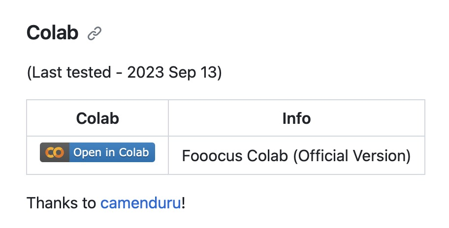
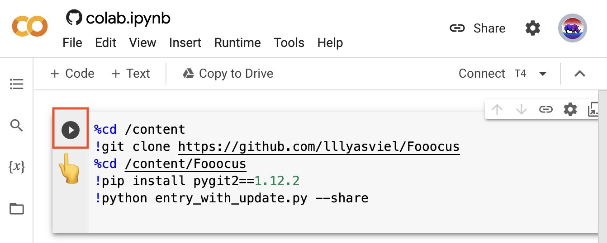
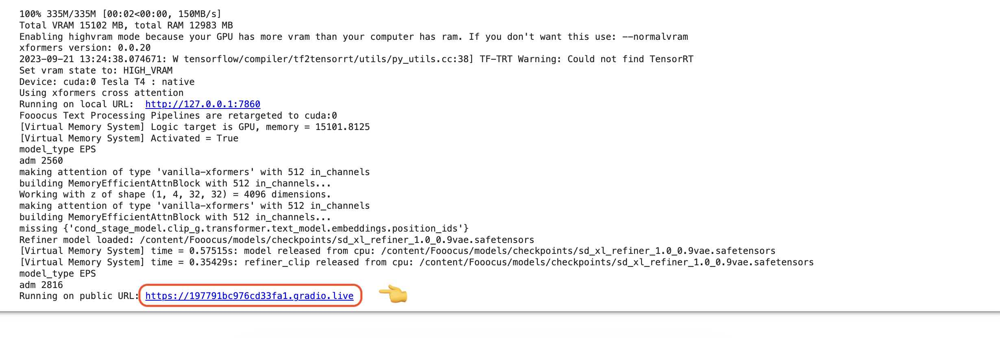
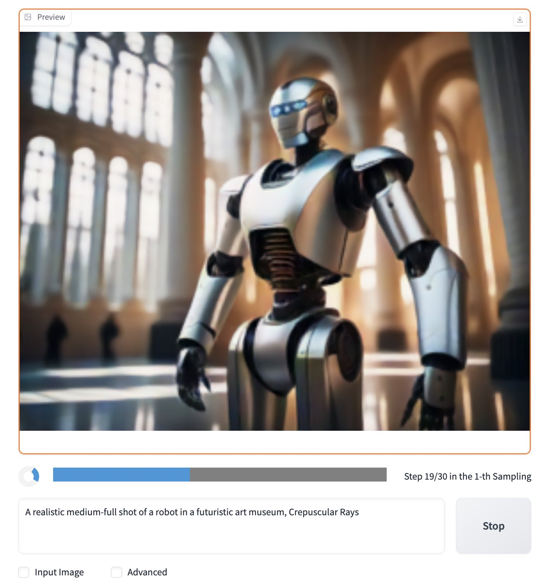
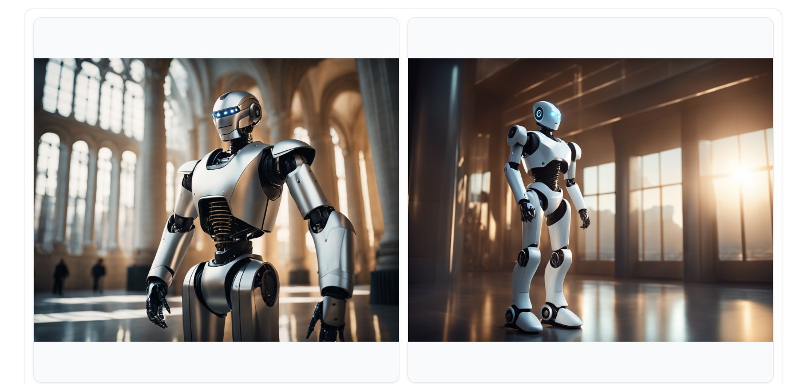
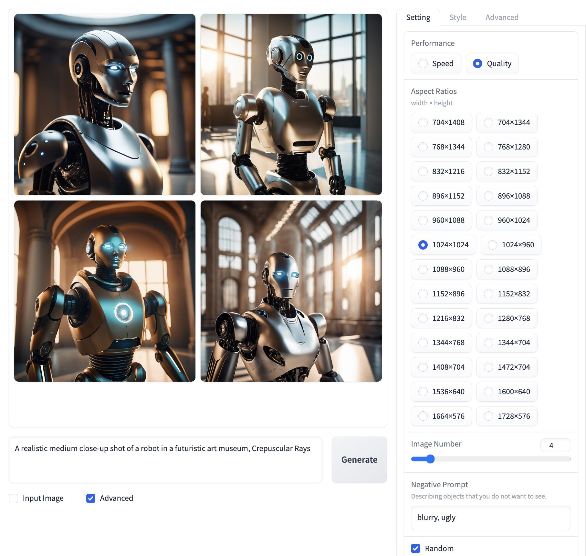
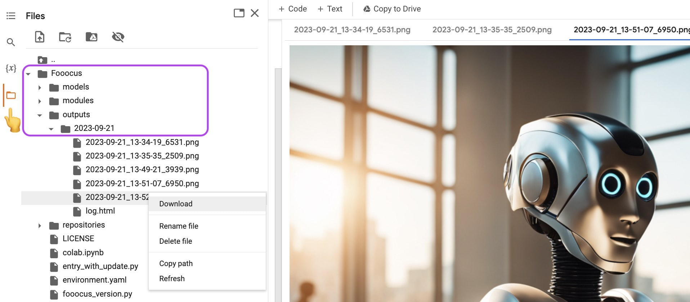

Fooocus isn't just another image-generating tool; it's an innovation reimagined through the lens of Stable Diffusion and Midjourney's finest design lessons. From its unique GPT2-based prompt expansion to its seamless k-diffusion sampling, Fooocus invites you on a journey to redefine image generation.



## Introduction & Background

> [lllyasviel/Fooocus](https://github.com/lllyasviel/Fooocus) `Focus on prompting and generating` is an _emerging_ image generating software based on Gradio.

In an era where the blend of technology and artistry frequently redefines the horizons of creativity, "Fooocus" emerges as a game-changer in the realm of image generation. Built on the solid foundation of Gradio, Fooocus isn't merely a tool—it's an experience, a revolution that marries the intricacies of generative machine learning with user-centric design.

Its inception was guided by the lessons learned from Stable Diffusion, ensuring that users benefit from an offline, open-source, and complimentary platform. At the same time, inspirations from Midjourney helped mold its user interface, making manual adjustments a thing of the past. The tool seamlessly directs users to focus solely on the prompts and the resulting images, thereby simplifying the process while enhancing the creative potential.

But beyond its foundational principles, the true beauty of Fooocus lies beneath its surface, in its intricate machinery. A slew of "hidden tricks" await the user, each carefully embedded to enhance the quality, coherence, and versatility of generated images. From its unique GPT2-based prompt expansion, aptly named "Fooocus V2", to its state-of-the-art k-diffusion sampling and native refiner techniques, Fooocus stands as a testament to how generative tools can evolve when driven by feedback, innovation, and a deep understanding of both user needs and technological potential.

Whether you're a seasoned artist, a tech enthusiast, or someone standing at the crossroads of both, Fooocus promises a journey—a voyage into the depths of generative art, where every prompt unveils a world of visual stories, waiting to be discovered.

## Getting Fooocus

Visit the project GitHub repo to access `Fooocus` [[lllyasviel/Fooocus]](https://github.com/lllyasviel/Fooocus)

For PC users who has an Nvidia card, installation is rather straightforward. Simply following the `>>> Click here to download <<<` guide provided in the `readme` page.


`Continue if you do NOT have a graphic card, on a Mac, or simply do NOT want to run Fooocus on your local machine 👇👇👇`


### Fooocus and Colab

> This guide was written `09/21/2023`, running Fooocus on `Colab free-tier` is subject to change due to its no-cost nature.

Locate the following section inside the `readme.md` document (should just be the project **landing page**) in the `Fooocus Github Repo` ([LINK](https://github.com/lllyasviel/Fooocus)) and click the `Open in Colab` icon.



The `Python` code itself is short and sweet,

```python
%cd /content
!git clone https://github.com/lllyasviel/Fooocus
%cd /content/Fooocus
!pip install pygit2==1.12.2
!python entry_with_update.py --share
```

One benefit for clicking `Open in Colab` is that it automatically select the `free-tier T4 GPU` for you (Otherwise, you can click the `Runtime` tab and then `Change Runtime Type`).

Make sure you are already signed in before you click the start button:



You may get a `Warning: This notebook was not authored by Google`, its just some standard warning you can simply dismiss it by `Run Anyway`.
**_Be paaaaaatient on Fooooooocus_**, it may take a while because it downloads `SD_XL` and `SD_XL_refiner` models (you should see a lot of outputs in your `Colab Notebook`).

Now, locate the `public URL` that looks like the following and click (our links will look different but as long as it ends with `gradio.io`):




`Please ensure the Colab Notebook webpage kept OPEN and Running while using Fooocus Web Client`


## Focus on Fooocus

### Create Your First Fooocus Image

I put in `A realistic medium-full shot of a robot in a futuristic art museum, Crepuscular Rays` without anything else, just hit `Generate`. (You can see the approximated image from the latent space during the process)



Ended up getting these two, not bad, isn't it?



### Advanced Options

> Let's get fancy, shall we?

Click the `Advanced` checkbox. Congratulations, you have unlocked **a new achievement**, with `Setting`, `Style`, and `Advanced` tabs. Most of settings are straightforward except for the `Advanced` tab, it may be a little bit overwhelming for us newcomers. Simply Fooocus on tweaking parameters in `Setting` and `Style`, then go back to their documentation to know more about those `Advanced` options.

The example below, _ONLY_ parameters from the `Setting` tab are changed (now we have `4`, `Quality` robots with some `Negative Prompts`).



### Retrieve Your Image

You can simply download the img from the `Fooocus Gradio Web Client`.

On the other hand, you can retrieve the images from your `Colab Notebook Instance` (Go back to your `Colab` page, `locate` and `click` the `file icon`, you will see the folder structure and locate the generated `.png` files).



> You can get more important information from `log.html`.

## Other Sample Images

> Note: **NO** `negative prompts` were used during generation process


**Prompt**: High-fashion high-angle photo from above shot from behind of a woman, Rembrandt Lighting


**Prompt**: medium-full shot of a person at the end of the universe, High-fashion, Bioluminescence


`Stay tuned for more in-depth analysis and updates on Fooocus; this is just the beginning of our comprehensive exploration.`

