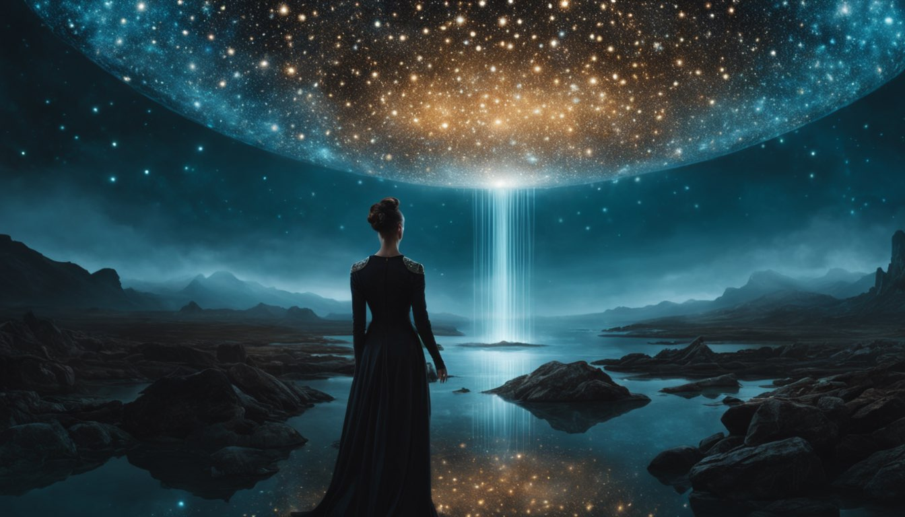

Fooocus isn't just another image-generating tool; it's an innovation reimagined through the lens of Stable Diffusion and Midjourney's finest design lessons. From its unique GPT2-based prompt expansion to its seamless k-diffusion sampling, Fooocus invites you on a journey to redefine image generation.



## Introduction & Background

In an era where the blend of technology and artistry frequently redefines the horizons of creativity, "Fooocus" emerges as a game-changer in the realm of image generation. Built on the solid foundation of Gradio, Fooocus isn't merely a tool—it's an experience, a revolution that marries the intricacies of generative machine learning with user-centric design.

Its inception was guided by the lessons learned from Stable Diffusion, ensuring that users benefit from an offline, open-source, and complimentary platform. At the same time, inspirations from Midjourney helped mold its user interface, making manual adjustments a thing of the past. The tool seamlessly directs users to focus solely on the prompts and the resulting images, thereby simplifying the process while enhancing the creative potential.

But beyond its foundational principles, the true beauty of Fooocus lies beneath its surface, in its intricate machinery. A slew of "hidden tricks" await the user, each carefully embedded to enhance the quality, coherence, and versatility of generated images. From its unique GPT2-based prompt expansion, aptly named "Fooocus V2", to its state-of-the-art k-diffusion sampling and native refiner techniques, Fooocus stands as a testament to how generative tools can evolve when driven by feedback, innovation, and a deep understanding of both user needs and technological potential.

Whether you're a seasoned artist, a tech enthusiast, or someone standing at the crossroads of both, Fooocus promises a journey—a voyage into the depths of generative art, where every prompt unveils a world of visual stories, waiting to be discovered.

## Sample Images

> Note: **NO** `negative prompts` were used during generation process

**Prompt**: High-fashion high-angle photo from above shot from behind of a woman, Rembrandt Lighting

**Prompt**: medium-full shot of a person at the end of the universe, High-fashion, Bioluminescence
