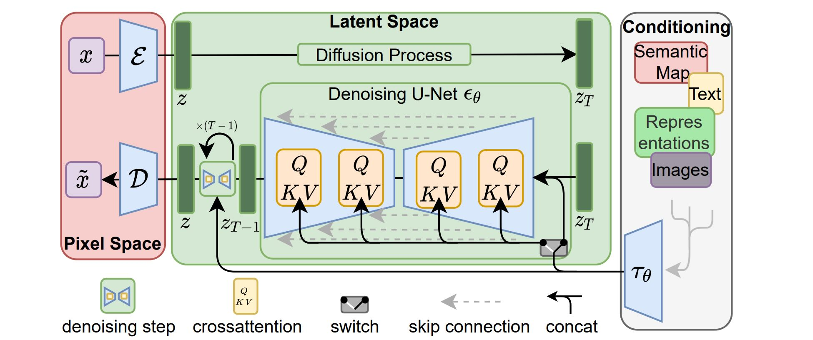
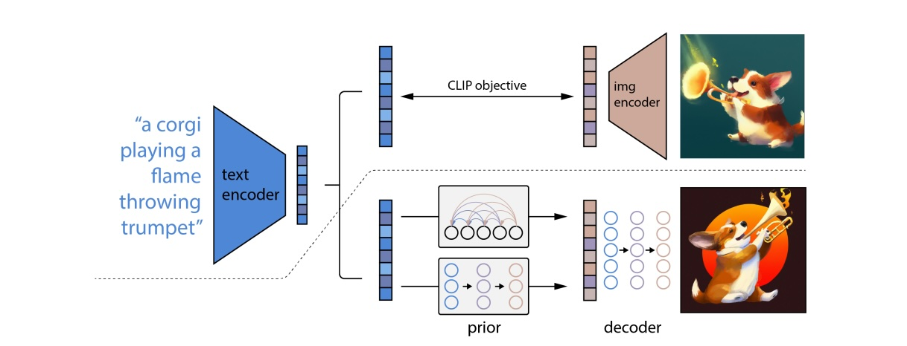
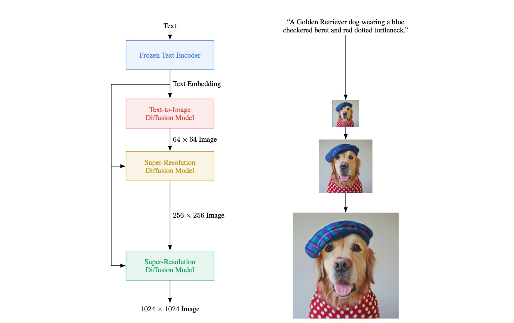

Diffusion-based models, exemplified by Mid-journey, DALL-E, and Stable Diffusion, offer a unique approach to data generation by applying random noise and evolving it over time. While each model has its unique features, they all showcase the potential of diffusion-based techniques in creating high-quality, natural-looking outputs in machine learning



## Background

In recent years, **diffusion-based models** have become a hot topic in the world of ML, offering a *unique* approach to generating **high-quality data** like images or text. *Unlike* traditional machine learning models, which typically operate through `straightforward mapping functions`, diffusion models work by **applying random noise to data and evolving it over time**. This results in a more organic, less predictable pattern that can generate more *natural-looking images* or produce more *nuanced textual outputs*.

Models like Mid-journey, DALL-E, and Stable Diffusion represent the cutting edge in this space. Mid-journey and Stable Diffusion are particularly focused on image generation and take advantage of an `offline`, `open-source framework` to ensure quality and accessibility. DALL-E, on the other hand, is widely celebrated for its capability to generate highly creative images based on textual prompts. While each has its own unique features and benefits, they all exemplify the power and potential of **diffusion-based techniques** in machine learning.

### Basic Frameworks

The best-in-class image generation models typically contain the following ***three*** *main* components (Those three components are usually trained separately and assembled together).


- `Text Encoder`: converts **texts** to **vectors** (Noted as `A`).
- `Generation Model`: takes `A` ***and*** some **random noise** as an input, and outputs some **intermediate representation** (Noted as `B`).
- `Decoder`: takes `B` (some *compressed* representation of an image) and tries to recovers the original.


### Some Examples

**Stable Diffusion**: [[ Src: High-Resolution Image Synthesis with Latent Diffusion Models]](https://arxiv.org/abs/2112.10752)

**DALL-E Series**: [[Src1: Zero-Shot Text-to-Image Generation]](https://arxiv.org/abs/2102.12092), [[Src2: Zero-Shot Text-to-Image Generations]](https://arxiv.org/abs/2204.06125)

**Imagen**: [[Src: Photorealistic Text-to-Image Diffusion Models with Deep Language Understanding]](https://arxiv.org/abs/2205.11487)

### Additional Info

> Some common terms found in papers.

#### More about Text Encoder

**FID (Fréchet inception distance)** is a metric used to assess the quality of images created by a generative model. It uses a `pre-trained CNN` (image *classification*) model. You will *throw* images (machine-generated *and* real) into the CNN model to obtain their `latent representations`. Then you can calculate the `Fréchet distance` based on the assumption that both distribution are ***gaussian*** (*Smaller* distance means better, *a lot of samples* are needed).

**CLIP (Contrastive Language-Image Pre-Training)** utilizes 400 million image-text pairs ([[link]](https://arxiv.org/abs/2103.00020)). CLIP has an `image encoder` and a `text encoder`; they *both* take inputs and generate vectors (*distances between vector* is used to see if the image-text pair a good match). 

#### More about Decoder

Decoder can be trained *without* labelled data (remember, it takes some `intermediate representations`, `B`).

1. `B` is a *smaller* image: decoder makes a *bigger* image.
2. `B` is a `latent Representation`: train a `auto-encoder`. (train an encoder-decoder pair, **take the decoder**)

#### More about Generation Model

Reminder: the `Generation Model` takes a *vector representation of the text*, and generate an (*somewhat* compressed) `intermediate representation` (or *just* the `latent representation`).

Noise is added to the `latent representation` during diffusion process (*this is something quite unique*).

1. Start with an `encoder` and generate some `intermediate representation`.
2. Add step-wise `noise`.
3. Train a `Noise Predictor`


`NOTE` : This section still seems *mystic*, will implement as the writing progresses.


## Some Mathematics Behind

### Basic Concepts

*Intuitively, there are --*

- **Forward Process**: sequentially adding noise to image till not able to see the original image.
- **Reverse Process**: sequentially denoising till recovering the image.

`VAE vs. Diffusion Model` has great resemblance. VAE uses an `encoder` to convert image to latent space, and use a `decoder` to recover image from its *latent representation*. The ***noise adding*** (N times) processes in the Diffusion Model can be treated as an `encoder` (in this case, not a NN that can be *learned*, it is *predefined* by human), and the **denoising** (N times) processes is like a `decoder`.

### Denoising Diffusion Probabilistic Models

#### Training
- **repeat**
   1. \\( \mathbf{x_0} \sim \mathbf{q(x_0)}\\) \\(\Lleftarrow \\) sample the *clean* image
   2. \\( t \sim \mathrm{Uniform (\lbrace 1, ... ,T \rbrace)} \\) \\(\Lleftarrow \\) sample a *whole* number
   3. \\( \mathbf{\epsilon} \sim  \mathcal{N}(0, \mathbf{I}) \\) \\(\Lleftarrow \\) sample *noise* (or `taget noise`)
   4. Take gradient descent step on \\(  \nabla_ {\theta}  {\Vert \mathbf{\epsilon} - \mathbf{\epsilon_ {\theta}}  (\sqrt{\bar{a_t}}\mathbf{x_0} + \sqrt{1 - \bar{a_t}}\mathbf{\epsilon}, t) \Vert}^2 \\) \\(\Lleftarrow \\) this is rather complicated.
      1. \\(\sqrt{\bar{a_t}}\mathbf{x_0} + \sqrt{1 - \bar{a_t}}\mathbf{\epsilon} \\) is just a `noisy image`, it is the weighted sum of \\(\mathbf{x_0}\\) and \\(\mathbf{\epsilon}\\), where \\( \underrightarrow{\bar{a}_1, \bar{a}_2, \dots, \bar{a}_T}\\) is a set of *predefined* weights that gradually goes smaller.
      2. \\( \mathbf{\epsilon_ {\theta}} \\) in \\(\mathbf{\epsilon_ {\theta}}  (\sqrt{\bar{a_t}}\mathbf{x_0} + \sqrt{1 - \bar{a_t}}\mathbf{\epsilon}, t) \\) is a `noise predictor`. It takes a `noisy image` and a number \\(t\\)
      3. The **target** (or **ground truth**) of the `noise predictor` is the `target noise` \\( \mathbf{\epsilon}\\) 
- **until** *converged*.

#### Inference 
Inference is the image generation process.

***Overview***: 
1. \\( \mathbf{x_ {\mathrm{T}}} \sim  \mathcal{N}(0, \mathbf{I}) \\) \\(\impliedby \\) sample an ***all-noise* image**
2. **for** \\(t = T, \dots, 1\\) **do**  \\(\impliedby \\) start of the **reverse process**, total \\(T\\) times
   1. \\( \mathbf{z} \sim  \mathcal{N}(0, \mathbf{I}) \\) if \\(t \gt 1\\), else \\(\mathbf{z=0}\\) \\(\impliedby \\) sample *another* *noise*, \\(\mathbf{z}\\)
   2. \\( \mathbf{x_ {\mathrm{t-1}}} = \frac{1}{\sqrt{a_t}} ( \mathbf{x_ {\mathrm{t}}} - \frac{1-\alpha_t}{\sqrt{1-\bar{\alpha_t}}} \mathbf{\epsilon_ {\theta}} (\mathbf{x_ {\mathrm{t}}},t) ) + \sigma_t \mathbf{z} \\)  \\(\impliedby \\)  \\(\mathbf{x_ {\mathrm{t-1}}} \\) is the `denoised` result.
      - \\( \mathbf{x_ {\mathrm{t}}} \\) is the **image** generated from the *previous* step. The image is ***pure noise*** when \\( \mathbf{x_ {\mathrm{t=T}}} \\)
      - Inside \\( \mathbf{x_ {\mathrm{t}}} - \frac{1-\alpha_t}{\sqrt{1-\bar{\alpha_t}}} \mathbf{\epsilon_ {\theta}} (\mathbf{x_ {\mathrm{t}}},t)\\), \\( \mathbf{\epsilon_ {\theta}} (\mathbf{x_ {\mathrm{t}}},t) \\) is the ***noise*** output from the `noise predictor`.
      - Adds one more ***niose*** times a constant, \\( \sigma_t \mathbf{z}  \\) 
3. **end for**
4. **return** \\(\mathbf{x}_0\\)

***Process***:

- Prepare following two series of predefined numerical values:
$$
\begin{cases}
   \bar{a}_1, \bar{a}_2, \dots, \bar{a}_T \\\
   a_1, a_2, \dots, a_T
\end{cases}
$$
- The `noise predictor` takes an image \\(x_t\\) and \\(t\\), yielding \\( \mathbf{\epsilon_ {\theta}} (\mathbf{x_ {\mathrm{t}}},t) \\)
  - \\( \mathbf{\epsilon_ {\theta}} (\mathbf{x_ {\mathrm{t}}},t) \\) times \\( \frac{1-\alpha_t}{\sqrt{1-\bar{\alpha_t}}} \\), which is used to subtract from \\( \mathbf{x_ {\mathrm{t}}}\\)
    - \\(a\\) is step-dependent
  - multiply by a fraction \\( \frac{1}{\sqrt{a_t}} \\)
- Add noise \\(\mathbf{z}\\) to get \\(\mathbf{x_ {\mathrm{t-1}}}\\)

> So, things are getting super trippy now, we need to step back for a little bit.

## Shared Goals For Generative Models

It simply looks like this:

$$
z \longrightarrow \theta \longrightarrow P_ {\theta}(x) \leftrightsquigarrow P_ {\mathrm{data}}(x)
$$

- Sample a vector \\(z\\) from a *known* distribution
- Put \\(z\\) into a network \\(\theta\\) plus some **condition** (for txt-img models)

### Maximum Likelihood Estimation

- Sample **images** \\( \lbrace x^1, x^2, \dots, x^m \rbrace \\) from \\(P_ {\mathrm{data}}(x)\\), \\(P_ {\mathrm{data}}(x)\\) is the *world* of possible images (the *entire* process is sampling training data)
- ***Assume*** we can *somehow* calculate \\( P_ {\theta}(x^i) \\), \\( P_ {\theta}(x^i) \\) is the probability of generating *any* **image** \\( x^i \\) from \\( P_ {\theta}\\). (this is a difficult process, \\( P_ {\theta}\\) is *not necessarily* a gaussian distribution)
- \\(\theta^*\\) can be defined as an *objective function* \\( arg {\mathrm{max} \atop \theta} \prod_ {i=1}^m  P_ {\theta}(x^i) \\)

#### Dive in

> Why `Maximum Likelihood` is equivalent to \\(P_ {\theta}(x) \leftrightsquigarrow P_ {\mathrm{data}}(x) \\)?  
> Because` Maximum Likelihood` = `Minimize KL Divergence`

### VAE

> For VAE (Variational Autoencoder), following the process described in the previous section. Sample \\(z\\), put in the network \\(\theta\\) which describe the relationship \\(G(z)=x\\) 
### DDPM 

> Denoising Diffusion Probabilistic Models (DDPM)
### Comparison

***VAE***: `Maximize` \\( log P_ {\theta}(x) \\) \\(\implies \\) Maximize \\(\mathrm{E}_ {q(z|x)}[log \lgroup \frac{}{} \rgroup] \\)

***DDPM***: `Maximize` \\( log P_ {\theta}(x_0) \\) \\(\implies \\) Maximize \\(\mathrm{E}_ {q(x_1:x_T|x_0)}[log \lgroup \frac{}{} \rgroup] \\)

### Forward Process

\\( q(x_{t}|x_{t-1})=\\)
\\( \mathcal{N}(x_{t};\sqrt{1-\beta_ {t}}x_ {t-1},\beta_ {t}I) \\)

\\( q(x_{1:T}|x_{0})=\prod_{t=1}^{T}q(x_{t}|x_{t-1})  \\)

### Forward Process Reparameterization Trick

### Reverse Process

$$
x_{t}=\sqrt{\alpha_{t}}x_ {t-1}+\sqrt{1-\alpha_{t}} \epsilon_ {t-1} \\\
=\sqrt{\alpha_{t}\alpha_{t-1}}x_{t-2} + \sqrt{1-\alpha_{t}\alpha_{t-1}} \bar{\epsilon}_{t-2} \\\
=\text{...}
$$

$$
=\sqrt{\bar{\alpha}_ {t}} x_{0}+\sqrt{1-\bar{\alpha}_{t}}\epsilon
$$

### Reverse Process Variational Lower Bound

$$
p_ \theta(\mathbf{x}_ {0:T}) = p(\mathbf{x}_ T) \prod^T_ {t=1} p_ \theta(\mathbf{x}_ {t-1} \vert \mathbf{x}_t)
$$

$$
p_\theta(\mathbf{x}_ {t-1} \vert \mathbf{x}_ t) = \mathcal{N}(\mathbf{x}_ {t-1}; \boldsymbol{\mu}_ \theta(\mathbf{x}_ t, t), \boldsymbol{\Sigma}_ \theta(\mathbf{x}_ t, t))
$$
###  Reverse Process Variational Lower Bound Loss Function