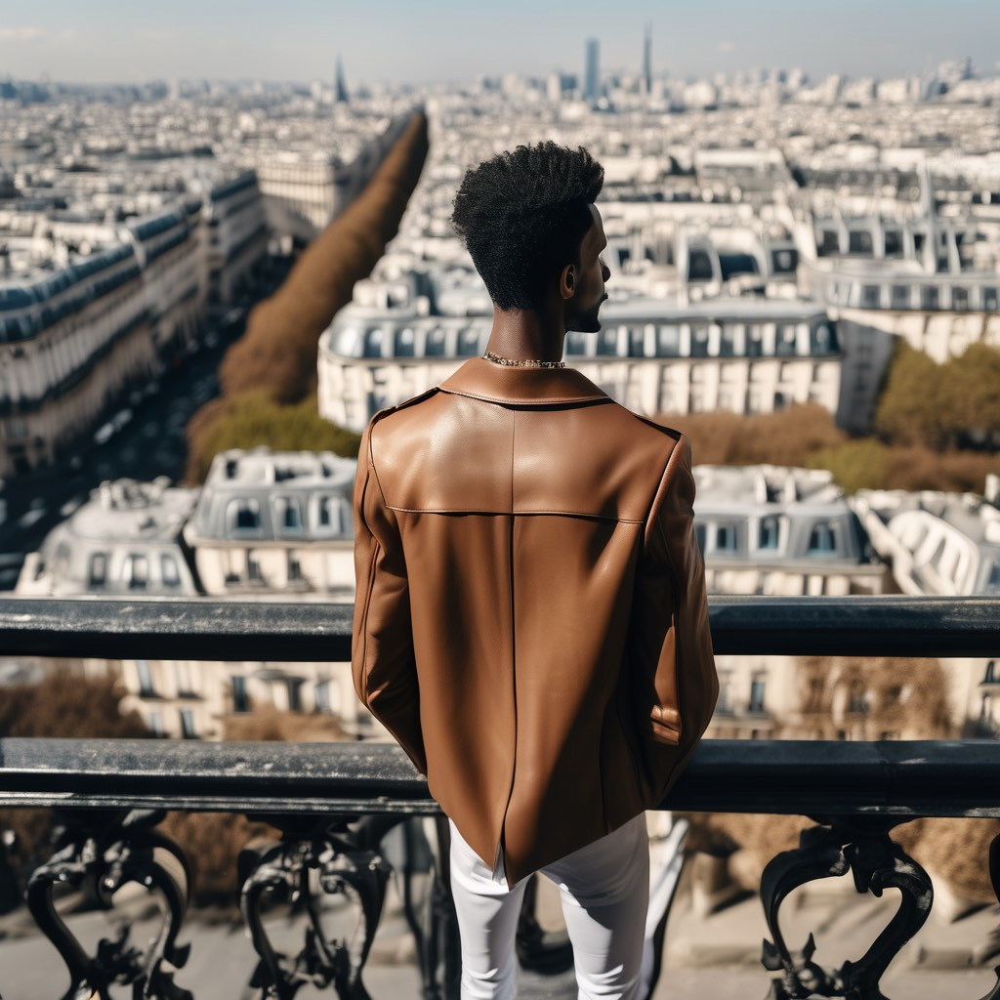

Harness the power of generative tools to navigate the nuances of multi-angle perspectives, paving the way for impeccable creations tailored towards your own needs, forging a path to bespoke photo-realistic masterpieces.



> "Why a Cubist painting? It's a testament to the art of seeing from many perspectives, the very heart of our journey towards generating flawless photo-realistic images."


`W.I.P. Alert`: **This page is still being worked on 😬 ... A LOT MORE to go!!**


## A Gentle Intro

> If you are new, here, we embrace a tool-agnostic approach, which ensures universality in prompt creation, empowering us to transcend specific platforms while crafting precise visual narratives.

### Composition

Generally you can construct your prompt like

>  `{compositoonal type}, {subject of your composition}, {whatever may not be covered}, {background, context, or whatever else fills out your composition}`.

More details on composition is beyond the scope of this article, but will be re-visited in the future.

### Context or Details

When formulating prompts for image generation models, **clarity** is paramount. Consider adding the following dimensions to your prompt to refine your vision:

- **Subject**: Whether it's a person, animal, location, character, or object, specificity in the main subject can drive more accurate outputs.
- **Medium**: Envision the final product. Would you prefer a photo, painting, illustration, sculpture, doodle, or even a tapestry?
- **Environment**: Contextualize the setting. Is it indoors, outdoors, perhaps on the moon, submerged underwater, or within the whimsical realms of Narnia or the Emerald City?
- **Lighting**: Describe the illumination. Opt for soft ambient, the moodiness of overcast, the vibrancy of neon, or the professionalism of studio lights.
- **Color Palette**: What tones resonate with your vision? Whether it's vibrant, muted, bright, monochromatic, colorful, black and white, or pastel, your choice can significantly impact the mood.
- **Mood**: Reflect on the emotion you wish to convey. It could range from the tranquility of sedate and calm to the dynamism of raucous and energetic atmospheres.
- **Composition**: Lastly, the framing and focus, be it a portrait, headshot, closeup, or even a bird's-eye view, play an integral role in your final masterpiece.

### The Tools Used in This Guide

All the images below are generated using the SDXL model. The machine I used is a `Macbook Pro` with `M1 Pro` chip (16GB unified memory).
 
SDXL generally does an *okay* job comparing to its predecessors, my `negative prompts` are quite simple: `((out of focus)), watermark, artist name, deformed`.

## Very Simple Camera Control

### Different Angles
#### Low-Angle

> A Low-Angle shot of a young adult female, in the front of a modern art gallery, [`{some notable names so I don't have to describe the figure 🫣}`], intricate detail, film grain and noise, 8K, cinematic

#### Eye-Level

> An eye-level shot of a young adult female, in the front of a modern art gallery, [`{some notable names so I don't have to describe the figure 🫣}`], intricate detail, film grain and noise, 8K, cinematic

#### High-Angle

> Street Style Extreme High-Angle Photo From Below of an adult male, modern art gallery, [`{some notable names so I don't have to describe the figure 🫣}`], intricate detail, film grain and noise, 8K

#### More Choices


**There are still few more key words, W.I.P 😬**


### Camera Distances

#### Medium shot

> eye-level medium shot of a young adult male, modern art gallery, trench coat, [`{some notable names so I don't have to describe the figure 🫣}`], buzz cut hair, smile, model looks at camera, intricate detail, film grain and noise, 8K

#### Closeup shot

>closeup shot of a young adult female, in the front of a modern art gallery, [`{some notable names so I don't have to describe the figure 🫣}`], intricate detail, film grain and noise, 8K

We may also try `extreme closeup shot`

>closeup shot of a young adult female, in the front of a modern art gallery, [`{some notable names so I don't have to describe the figure 🫣}`], intricate detail, film grain and noise, 8K

#### Full-body Shot


**This image is a little ... *complicated*, its actually `full-body shot`, and `Ultra-wide` combined. Also, you may need to adjust the `size` (aspect ratio) of your `canvas` to make sure your human subject is not cropped (a lot of trials an errors) 😬**


>Ultra-wide angle photo-realistic, A full-body shot of a stylish woman wearing leather boots standing in front of a rainbow neon sign in a modern Tokyo street, black sunglasses,[`{some notable names so I don't have to describe the figure 🫣}`], film grain

## Combined Prompts

> High-fashion high-angle photo from above shot from behind of a woman, shot on Sony a9, natural lighting

> High-fashion side view low-angle closeup photo from below of a Swedish woman, shot on Sony a9, natural lighting

> High-fashion extremely high-angle photo from above shot from behind of an attractive young ethiopian male model, Paris city view, shot on Sony a9, natural lighting