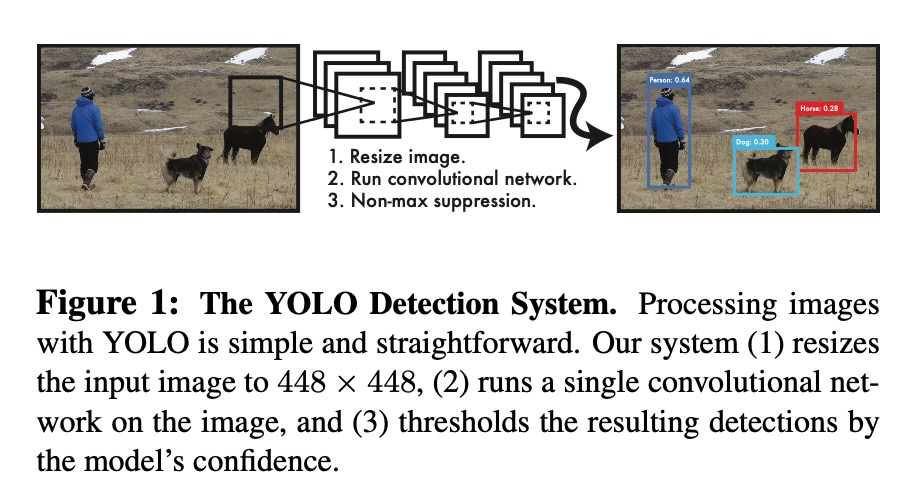
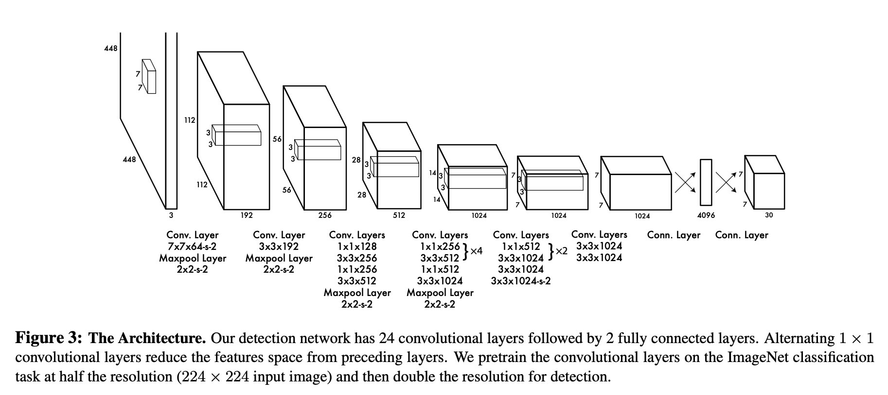
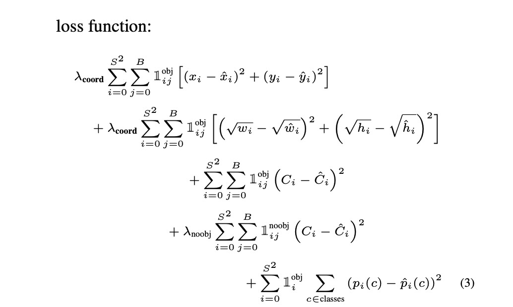
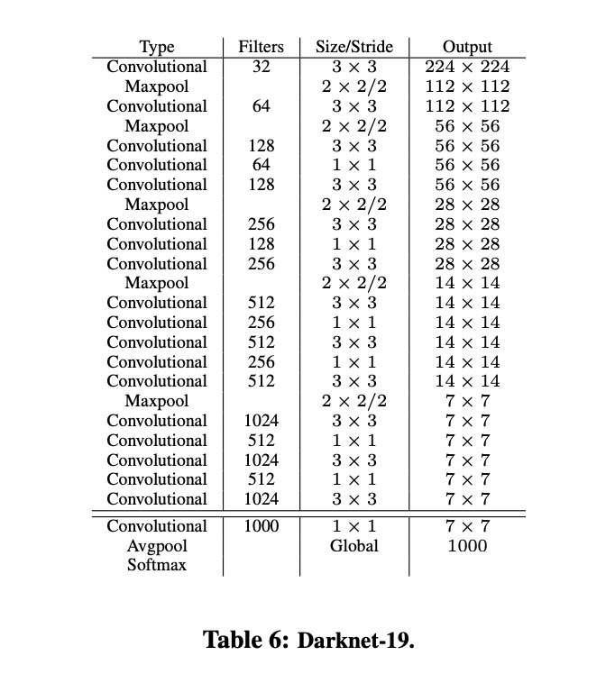
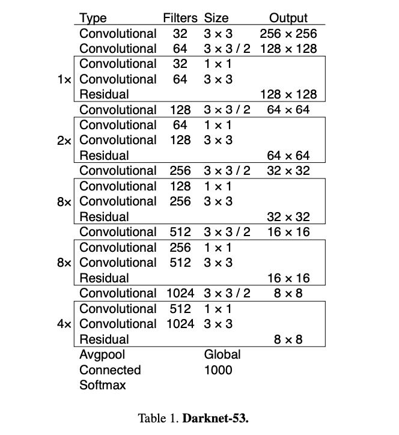
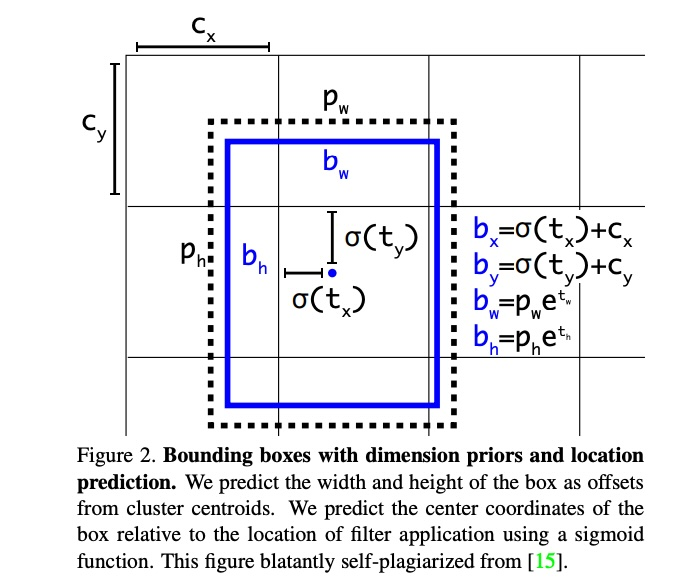
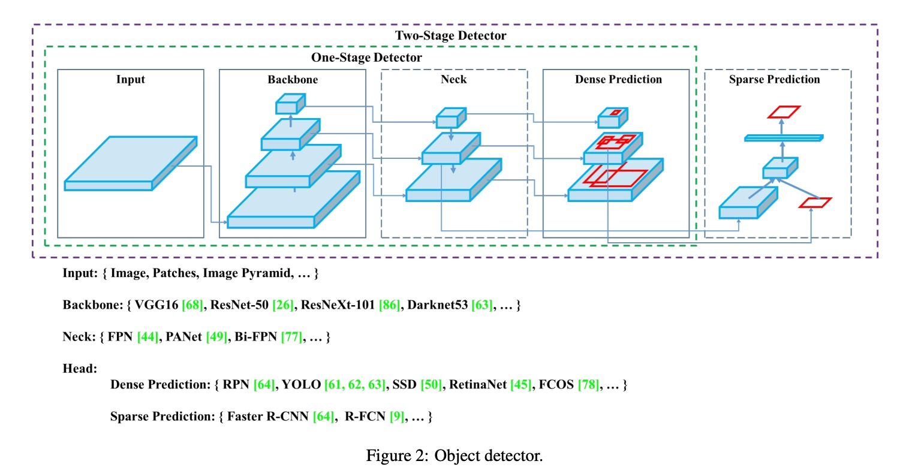



> The YOLO series of object detectors prioritizes speed and simplicity by framing object detection as a single regression problem. A single neural network directly predicts bounding boxes and class probabilities from the full image.

## YOLOv1

`YOLOv1`, in _[the article](https://arxiv.org/abs/1506.02640)_ `You Only Look Once`: Unified, Real-Time Object Detection, reframes the object detection problem into a single regression task. _Unlike_ previous methods that _merely_ repurposed classifiers for detection, YOLOv1 uses a single neural network (NN) to directly predict both the `bounding box` and the corresponding `class probability` from an _entire_ image over a **single** evaluation.

Most other methods before YOLO typically typically do the following (can be complex, slow, and difficult to optimize due to multi-stage pipelines):

1. Generate potential bounding boxes.
2. Classify objects within those boxes.
3. Refine the bounding boxes through some post-processing.

YOLOv1 stands out by offering

- **A Unified Model**: Single network handles bounding box prediction and class probability estimation.
- **A Regression-Based Approach**: Object detection is re-imagined as a regression problem by directly working on image pixels.
- **End-to-End Optimization**: The entire network is trained jointly. (For detection performance).
- **Real-Time Speed**: YOLOv1 achieves real-time object detection. (Applications like video processing).

**YOLOv1**, designed for speed and efficiency, processes images at 45 frames per second (fps). Its smaller version, Fast YOLO, processes images at 155 fps, achieving double the mean average precision (mAP) of _other_ real-time detectors.

### Unified Detection in YOLOv1

Researcher in YOLOv1 paper unified the separate components of object detection into a single neural network. The network uses features from the entire image to predict each bounding box. It also predicts all bounding boxes across all classes for an image **_simultaneously_**. (The network reasons _globally_ about the full image and all the objects in the image)

YOLOv1 uses single NN:

It employs a single convolutional neural network (CNN) to process the entire image. This network `takes an input image and outputs a fixed-size grid of predictions`.

YOLOv1 does grid-based detection:

- The input image is divided into an 𝑆×𝑆 grid. Each grid cell is responsible for detecting objects whose center falls within the cell.
- For each grid cell, the model predicts a fixed number of bounding boxes (B). Each bounding box consists of:
  - Bounding Box Coordinates: (𝑥,𝑦,𝑤,ℎ)
    - (𝑥,𝑦) coordinates represent the center of the box relative to the bounds of the grid cell.
    - The 𝑤 and ℎ (width and height) are predicted relative to the whole image.
  - Confidence Score: Reflects how confident the model is that the box contains an object and also how accurate it thinks the box is that it predicts.
  - Class Probabilities (C): Each grid cell also predicts class probabilities for the object within the bounding box.

The YOLO framework uses a custom network based on the Googlenet architecture.

#### Definition of Confidence in YOLOv1

\\(\\)

confidence score for each predicted bounding box is defined as:

\\(Confidence=P(Object)×IOU(pred,truth)\\)

- \\(P(Object)\\) is the probability that an object is present in the bounding box.
- \\(\text{IOU}(\text{pred}, \text{truth})\\) is the Intersection over Union between the predicted bounding box and the ground truth bounding box.

Therefore, for a bounding box \\(i\\) in a grid cell \\(j\\) in the model, confidence is defined as:

\\(C\_ {ij} = P(\text{Object})\_{ij} \times \text{IOU}\_{ij}\\)

- \\(C\_ {ij}\\) represents the model’s certainty that an object exists in the bounding box, a value between 0 and 1.
- Intersection over Union (IoU) is a measure of how well the predicted bounding box overlaps with the ground truth bounding box.

#### YOLOv1 Loss Function Components

YOLOv1 uses a single loss function during training and contains three components:

- Localization Loss: Measures the error between the predicted bounding box coordinates and the ground truth coordinates.
- Confidence Loss: Measures the difference between the predicted confidence scores and the ground truth (1 for objects, 0 for no objects).
- Classification Loss: Measures the error in class prediction.

## YOLOv2

`YOLOv2`, and its twin model `YOLO9000`, introduced several technical advancements over YOLOv1 and improveed both its speed and accuracy.

> Error analysis of YOLO compared to Fast R-CNN shows that YOLO makes a significant number of localization errors. Furthermore, YOLO has relatively low recall compared to region proposal-based methods. Thus we focus mainly on improving recall and localization while maintaining classification accuracy -- YOLO9000: `Better`, `Faster`, `Stronger`

### Better

#### Batch Normalization

Leads to significant improvements in convergence while eliminating the need for other forms of regularization.

#### High Resolution Classifier

The original YOLO trains the classifier network at 224 × 224. YOLOv2 first fine tune the classification network
at the full 448 × 448 resolution for 10 epochs on ImageNet, which gives the network time to adjust its filters to work better on higher resolution input

#### Anchor Boxes

Researcher removed the fully connected (FC) layers from YOLO and use anchor boxes to predict bounding boxes.

The original YOLO predicts the coordinates of bounding boxes _directly_ using FC layers on top of the convolutional feature extractor, while models like Faster R-CNN predicts offsets and confidences for
anchor boxes (region proposal network RPN) with hand-picked priors.

### Faster & Stronger

#### Darknet-19

Darknet-19 (base network of YOLOv2) has 19 convolutional layers and 5 maxpooling layers. Similar to the `VGG` models, researcher use mostly 3 × 3 filters and double the number of channels after every pooling step. **Batch normalization** was also used to stabilize training, speed up convergence, and regularize the model

#### Joint classification and detection

A mechanism for jointly training on classification and detection data was used in YOLOv2. During training images from both `detection` and `classification` datasets were mixed. When the network sees an image labelled for detection, it backpropagates based on the **full** YOLOv2 loss function. When it sees a classification image, it only backpropagates loss from its **classification specific part**.

## YOLOv3: An Incremental Improvement

> We present some updates to YOLO! We made a bunch of little design changes to make it better. We also trained this new network that’s pretty swell. It’s a little bigger than last time but more accurate. It’s still fast though, don’t worry. At 320 × 320 YOLOv3 runs in 22 ms at 28.2 mAP, as accurate as SSD but three times faster -- Joseph Redmon and Ali Farhadi.

### A New Network Architecture -- Darknet-53

Darknet-53, consists of 53 convolutional layers, is used to perform feature extraction. (A _hybrid_ between YOLOv2 `Darknet-19` and residual networks `ResNet`).

### Better Bounding Box Prediction

YOLOv3 predicts an objectness score for each bounding box using logistic regression (p is box prior). (It knows when to ignore if under a certain threshold)

> We predict the **width** and **height** of the box as offsets from cluster centroids. We predict the center coordinates of the box relative to the location of filter application using a `sigmoid` function.

YOLOv3 predicts boxes at 3 different scales.

## YOLOv4: Optimal Speed and Accuracy of Object Detection

YOLOv4, introduced by Alexey Bochkovskiy, Chien-Yao Wang, and Hong-Yuan Mark Liao, represents a substantial upgrade.

## YOLOv5 and Beyond

Now developed by `Ultralytics`
